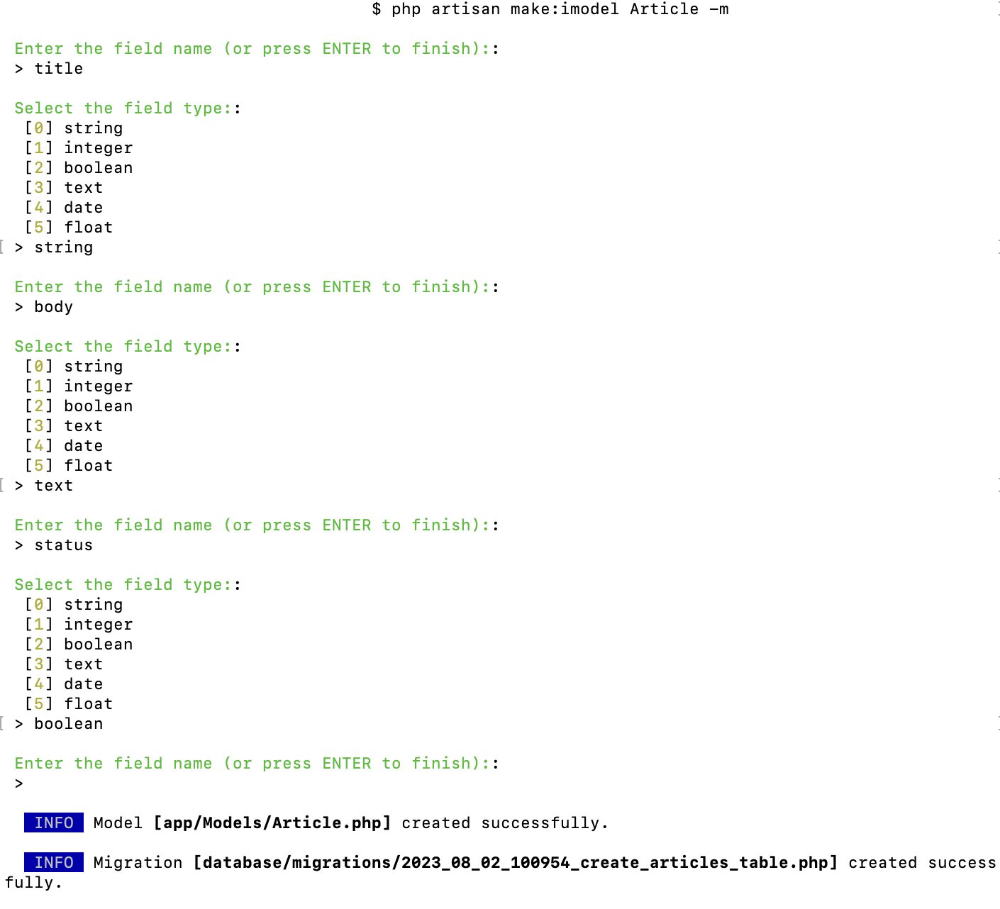

# laravel-interactive-make
Interactive make commands for making Model and Migration with fields

```shell
composer require mirhamzah/laravel-interactive-make:dev-master
```
Then
```shell
php artisan make:imodel ModelName
```
Or
```shell
php artisan make:imodel ModelName -m
```
for making a new migration as well, just like with normal make:model command.



You can add relationships to existing model files using the command
```shell
#php artisan make:relationship [SourceModel] [RelationshipType] [TargetModel]

php artisan make:relationship User HasMany Acrticle
```

The above command will add following code to User model file:

```php
use Illuminate\Database\Eloquent\Relations\HasMany;

public function articles(): ?HasMany
{
    return $this->hasMany(Article::class);
}
```